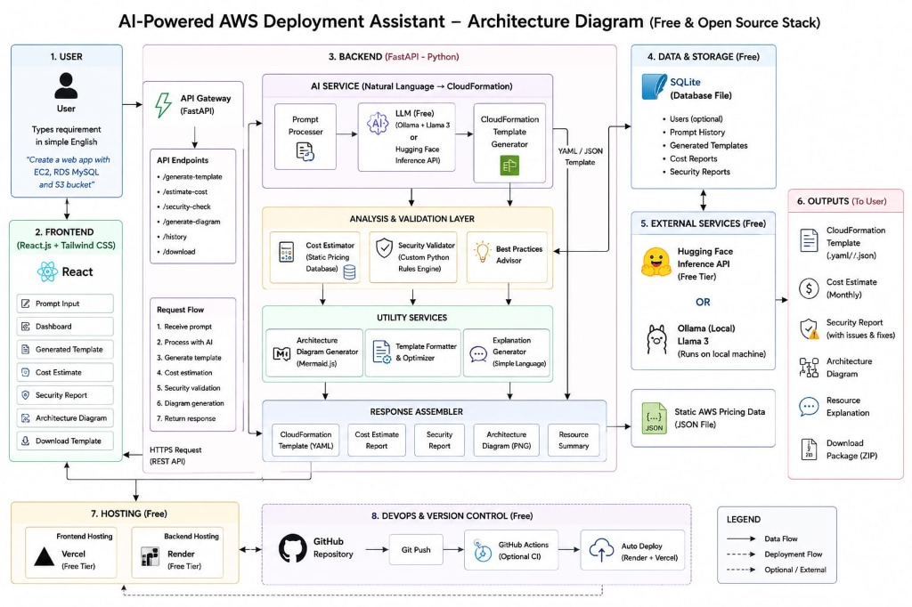

# ☁️ AI-Powered AWS Deployment Assistant

> **Capstone Project** — Convert natural language infrastructure requirements into production-ready AWS CloudFormation templates, with cost estimates, security reports, and architecture diagrams.



---

## ✨ Features

| Feature | Description |
|---------|-------------|
| 🤖 **Natural Language → CloudFormation** | Describe your infrastructure in plain English, get a valid CloudFormation YAML/JSON template |
| 💰 **Cost Estimation** | Automatic monthly cost breakdown for all AWS resources in your template |
| 🔒 **Security Analysis** | Rule-based security validation with actionable fix recommendations |
| 📊 **Architecture Diagrams** | Auto-generated Mermaid.js diagrams of your infrastructure |
| 📝 **Plain-English Explanations** | Every resource explained in simple language |
| 📦 **Download Package** | Export everything as a ZIP (template + reports + diagram) |
| 📜 **History** | Track and revisit all your past generations |

---

## 🏗️ Architecture

```
┌─────────────┐     HTTPS      ┌──────────────────────────────────────┐
│   Frontend   │ ──────────────▶│          Backend (FastAPI)           │
│  React.js +  │                │                                      │
│ Tailwind CSS │◀──────────────│  ┌─────────────┐  ┌───────────────┐  │
└─────────────┘    JSON        │  │ LLM Service │  │  CloudFormation│  │
                               │  │ (Ollama /   │  │  Generator    │  │
                               │  │  HuggingFace)│  └───────────────┘  │
                               │  └─────────────┘                      │
                               │  ┌─────────────┐  ┌───────────────┐  │
                               │  │    Cost      │  │   Security    │  │
                               │  │  Estimator   │  │  Validator    │  │
                               │  └─────────────┘  └───────────────┘  │
                               │                                      │
                               │  ┌─────────────┐  ┌───────────────┐  │
                               │  │  Diagram     │  │  SQLite DB    │  │
                               │  │  Generator   │  │  (History)    │  │
                               │  └─────────────┘  └───────────────┘  │
                               └──────────────────────────────────────┘
```

---

## 🛠️ Tech Stack

| Layer | Technology |
|-------|-----------|
| **Frontend** | React 18, Vite, Tailwind CSS, React Router v6 |
| **Backend** | Python 3.11+, FastAPI, SQLAlchemy (async), Pydantic v2 |
| **Database** | SQLite (via aiosqlite) |
| **LLM** | Ollama (Llama 3) or HuggingFace Inference API |
| **Validation** | cfn-lint |
| **Hosting** | Vercel (frontend), Render (backend) |

> 💡 **100% free and open source** — no paid APIs required.

---

## 🚀 Quick Start

### Prerequisites

- **Python 3.11+** — [Download](https://www.python.org/downloads/)
- **Node.js 18+** — [Download](https://nodejs.org/)
- **Ollama** (recommended) — [Download](https://ollama.com/) — or a free [HuggingFace API token](https://huggingface.co/settings/tokens)

### 1. Clone the repository

```bash
git clone https://github.com/divyansh-070/AI-Powered-AWS-Assistant.git
cd AI-Powered-AWS-Assistant
```

### 2. Set up the Backend

```bash
cd backend

# Create a virtual environment (recommended)
python -m venv venv
source venv/bin/activate        # Linux/Mac
# venv\Scripts\activate         # Windows

# Install dependencies
pip install -r requirements.txt

# Configure environment
cp .env.example .env
# Edit .env with your settings (see Configuration section below)

# Start the server
uvicorn app.main:app --reload --port 8000
```

### 3. Set up the Frontend

```bash
cd frontend

# Install dependencies
npm install

# Start the dev server
npm run dev
```

### 4. Open the app

Navigate to **http://localhost:5173** in your browser.

---

## ⚙️ Configuration

Copy `backend/.env.example` to `backend/.env` and configure:

```env
# LLM Provider: "ollama" (local) or "huggingface" (cloud)
LLM_PROVIDER=ollama

# Ollama settings (if using Ollama)
OLLAMA_BASE_URL=http://localhost:11434
OLLAMA_MODEL=llama3

# HuggingFace settings (if using HuggingFace)
HF_API_TOKEN=your_token_here

# Database
DATABASE_URL=sqlite+aiosqlite:///./data/app.db

# CORS (comma-separated origins)
CORS_ORIGINS=http://localhost:5173
```

### LLM Setup

**Option A — Ollama (recommended for development):**
```bash
# Install Ollama, then:
ollama pull llama3
```

**Option B — HuggingFace (no local GPU needed):**
1. Create a free account at [huggingface.co](https://huggingface.co)
2. Generate an API token at [huggingface.co/settings/tokens](https://huggingface.co/settings/tokens)
3. Set `LLM_PROVIDER=huggingface` and `HF_API_TOKEN=hf_xxx` in your `.env`

> ⚠️ **Never commit your `.env` file.** It is excluded via `.gitignore`.

---

## 📁 Project Structure

```
├── backend/                        # FastAPI Python backend
│   ├── app/
│   │   ├── main.py                 # FastAPI app entry point
│   │   ├── config.py               # Environment configuration
│   │   ├── database.py             # SQLAlchemy async setup
│   │   ├── models.py               # ORM models
│   │   ├── schemas.py              # Pydantic schemas
│   │   ├── routers/                # API endpoint handlers
│   │   │   └── generate.py         # POST /api/v1/generate-template
│   │   └── services/               # Business logic
│   │       ├── llm_service.py      # LLM abstraction layer
│   │       ├── prompt_processor.py # Prompt engineering
│   │       ├── template_generator.py
│   │       └── explanation_generator.py
│   ├── data/                       # SQLite database directory
│   ├── .env.example                # Environment template
│   └── requirements.txt
│
├── frontend/                       # React frontend
│   ├── src/
│   │   ├── components/             # Reusable UI components
│   │   ├── pages/                  # Route-level pages
│   │   ├── services/               # API client
│   │   └── App.jsx                 # Root component
│   ├── package.json
│   └── vite.config.js
│
└── .gitignore
```

---

## 🔌 API Endpoints

| Method | Endpoint | Description |
|--------|----------|-------------|
| `GET` | `/` | Service status |
| `GET` | `/health` | Health check (incl. LLM availability) |
| `POST` | `/api/v1/generate-template` | Generate CloudFormation template from prompt |
| `POST` | `/api/v1/estimate-cost` | Estimate monthly cost *(Phase 2)* |
| `POST` | `/api/v1/security-check` | Run security validation *(Phase 2)* |
| `POST` | `/api/v1/generate-diagram` | Generate architecture diagram *(Phase 2)* |
| `GET` | `/api/v1/history` | List generation history *(Phase 3)* |
| `GET` | `/api/v1/download/{id}` | Download result package *(Phase 3)* |

### Example Request

```bash
curl -X POST http://localhost:8000/api/v1/generate-template \
  -H "Content-Type: application/json" \
  -d '{"prompt": "Create a web app with EC2, RDS MySQL, and S3 bucket"}'
```

### Example Response

```json
{
  "template_yaml": "AWSTemplateFormatVersion: '2010-09-09'\nResources:\n  ...",
  "template_json": { "AWSTemplateFormatVersion": "2010-09-09", "Resources": {} },
  "explanation": "This template creates three AWS resources: ...",
  "prompt_id": 1
}
```

---

## 🔒 Security

- **No secrets in code** — all sensitive configuration is loaded from environment variables via `.env`
- **`.env` is gitignored** — never committed to version control
- **CORS restricted** — only configured origins can access the API
- **Input validation** — all inputs validated via Pydantic schemas with length constraints
- **Error handling** — internal errors return generic messages, not stack traces
- **LLM output validation** — generated templates are parsed and validated before returning

---

## 🧪 Running Tests

```bash
# Backend tests
cd backend
pytest tests/ -v

# Frontend build verification
cd frontend
npm run build
```

---

## 🌐 Custom Backend & Remote URL Configuration

To connect the frontend to a remote/cloud backend server (instead of `http://localhost:8000`), configure the environment variables:

### 1. Local Frontend connected to Remote Backend
Create `frontend/.env`:
```env
VITE_BACKEND_TARGET=https://your-backend-api.onrender.com
```
Then start Vite:
```bash
cd frontend
npm run dev
```

### 2. Production Frontend (Netlify / Vercel) connected to Remote Backend
Set environment variable in your Netlify or Vercel dashboard:
```env
VITE_API_BASE_URL=https://your-backend-api.onrender.com/api/v1
```

---

## 🚢 Deployment

### 1. Backend → Render (Free Cloud API)
1. Push your repository to GitHub.
2. Create a new **Web Service** on [Render.com](https://render.com).
3. Set **Root Directory** to `backend`.
4. **Build Command**: `pip install -r requirements.txt`
5. **Start Command**: `uvicorn app.main:app --host 0.0.0.0 --port $PORT`
6. Set Environment Variables:
   - `LLM_PROVIDER`: `huggingface`
   - `HF_API_TOKEN`: `your_huggingface_api_token`
   - `CORS_ORIGINS`: `https://your-frontend.netlify.app`
   - `DATABASE_URL`: `sqlite+aiosqlite:///./data/app.db`

### 2. Frontend → Netlify (Free Web Hosting)
1. Push code to GitHub (includes pre-configured `netlify.toml`).
2. Log into [Netlify.com](https://netlify.com) and click **Add new site** → **Import an existing project**.
3. Set **Base directory** to `frontend`, **Build command** to `npm run build`, and **Publish directory** to `frontend/dist`.
4. Update `netlify.toml` with your deployed Render backend URL:
   ```toml
   [[redirects]]
     from = "/api/*"
     to = "https://your-backend-api.onrender.com/api/:splat"
     status = 200
     force = true
   ```
5. Deploy! Your Netlify web app will be live at `https://your-app-name.netlify.app`.

---

## 📋 Roadmap

- [x] **Phase 1** — Core MVP (prompt → CloudFormation template)
- [ ] **Phase 2** — Cost estimation, security validation, architecture diagrams
- [ ] **Phase 3** — History, download packaging, CI/CD, deployment

---

## 👥 Team

*Capstone Project — 2026*

---

## 📄 License

This project is part of an academic capstone. All rights reserved.
